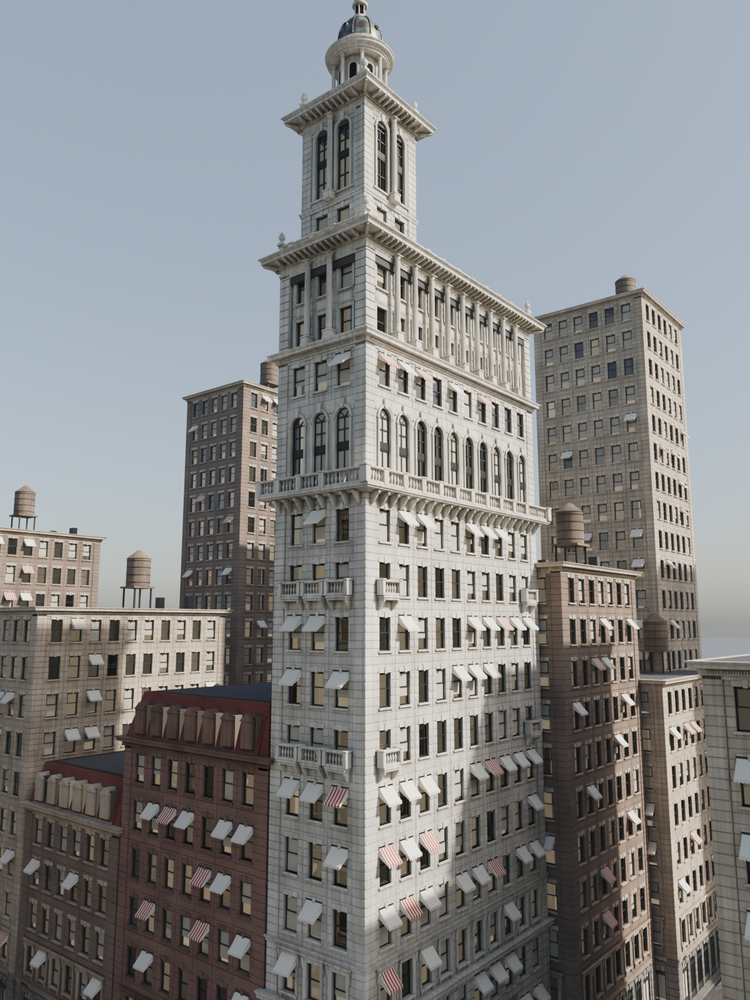

# Gillender Building: modular Blender kit


A procedural, grid-based modular kit of the **Gillender Building** (Wall St & Nassau St, New York, 1897, demolished 1910), plus the full building assembled only from instances of that kit, set in a street scene. `gillender_modular.py` generates all of it, so you can tweak a dimension and rebuild in seconds.

| Hero | Photo-match viewpoint |
|---|---|
|  |  |

| Detail: arcade, colonnade and cornice | Detail: tower and cupola |
|---|---|
|  |  |


## Matches the real building

| | Real building | Model |
|---|---|---|
| Lot | 26 × 73 ft (7.9 × 22.3 m) | 7.8 × 21.8 m (3 × 10 bays) |
| Storeys | 20 (17 main + 3 in the tower) | 17 main + 3 in the tower, then the cupola |
| Height | 273 ft (83 m) | 82.8 m to the finial |

Main body, bottom to top:

1. Granite shopfront ground floor, with a two-storey arched entrance on Nassau St
2. Two rusticated storeys with jack-arch lintels, then the base cornice
3. One storey of hooded windows
4. Eight shaft storeys with balconettes on two levels and awnings
5. A two-storey arcade with a continuous balustraded balcony
6. One storey, then the mid cornice
7. A two-storey Corinthian colonnade
8. The main modillion cornice and balustrade

The tower adds one storey plus a two-storey arcade with columns, then a cornice and balustrade. On top sit the columned tempietto, the ribbed copper dome and the lantern.

## Files

| File | What it is |
|---|---|
| `gillender_modular.py` | Generator: kit, materials, assembly, street scene, cameras, renders, exports |
| `out/gillender_modular.blend` | Blender 4.2 scene with collections `Gillender_Kit`, `Gillender_Building`, `Context`, `Kit_Variants`, `Lights_Cameras` |
| `out/gillender_kit.glb` | Every kit piece as a separate node |
| `out/gillender_building.glb` | The assembled building (instanced meshes) |
| `out/render_*.png` | Cycles renders |
| `reference_gillender_1900s.jpg` | Public-domain Detroit Publishing Co. photochrom that was used as the reference |

## Grid

| | |
|---|---|
| Bay width | 2.0 m |
| Corner pier | 0.9 × 0.9 m |
| Floor height | 3.35 m (ground floor 4.8 m) |
| Wall depth | 0.4 m |

All piece dimensions derive from these constants at the top of the script.

Module pivot: bottom-left of the bay. The facade plane is at local `y = 0`, the facade faces local `-Y` and the interior is `+Y`. Corner pieces sit at the corner and wrap the facade (`-Y`) and the previous side (`-X`). Window inserts share the pivot of their wall, so they snap with the same transform.

## Kit (38 pieces)

- **Walls:** `SM_Wall_Ground_Shop`, `SM_Wall_Ground_Entrance`, `SM_Wall_Base_Rustic`, `SM_Wall_Win_Hood`, `SM_Wall_Win_Shaft`, `SM_Wall_Arch_2F`, `SM_Wall_Colonnade_2F`
- **Corner piers:** `SM_Pier_Corner_Ground`, `_Rustic`, `_Shaft`
- **Inserts** (each has an interior room behind the glass): `SM_Window_Sash`, `SM_Window_Arch_2F`, `SM_Window_Shop`, `SM_Door_Entrance`
- **Horizontal pieces (straight and corner):** `SM_Cornice_Main` (dentils and modillions), `SM_Cornice_Mid`, `SM_Cornice_Base`, `SM_String_Course`, `SM_Balcony`, `SM_Balustrade`
- **Props:** `SM_Balconette`, `SM_Column_2F` (fluted Corinthian), `SM_Awning`, `SM_Urn`, `SM_Roof_Slab`
- **Crown:** `SM_Tempietto`, `SM_Dome`, `SM_Lantern`
- **Street kit:** `SM_Mansard` and `_Corner` (tiled, with dormers), `SM_Water_Tank`, `SM_Lamp_Post`

Every building object is a linked duplicate of a kit mesh. If you edit a mesh in `Gillender_Kit`, all of its instances update.

The neighbouring buildings reuse the same meshes. `Kit_Variants` holds copies that swap the limestone for red brick, brown brick or buff terracotta.

## Materials and UVs

The materials are procedural Cycles node setups:

- **Stone:** large-scale tone noise and a per-block tone shift (`Random Per Island`), plus rain streaks, grime that gets heavier toward the street, and AO soot in the joints.
- **Glass:** transmissive panes with an interior room behind each window. The rooms vary in tone, and some show a lamp.
- **Per-window variation:** blinds and awnings are chosen per instance (`Object Info > Random`). Most awnings are cream canvas, and a few are striped.
- **Other surfaces:** brick, granite setts, paving flags, tile and copper patina.

The hero and photo-match shots add a light aerial-perspective haze in the compositor, driven by the mist pass. Every mesh has a box-projected `UVMap` at 2 m per UV tile, so you can swap in tiling textures. The `.glb` exports use flat stand-in colours because glTF can't carry procedural nodes.

## Rebuild

```sh
# Blender 4.2+
blender -b -P gillender_modular.py -- --out out --render --ref reference_gillender_1900s.jpg

# or with the bpy wheel (pip install bpy==4.2.0, Python 3.11)
python gillender_modular.py --out out --render --ref reference_gillender_1900s.jpg
```

Options:

- `--samples N`: default 128
- `--scale PCT`: resolution percentage
- `--only hero,photo,detail,breakdown,kit`: render only the listed shots
- Leave out `--render` to build the scene and exports only (about 10 s)
