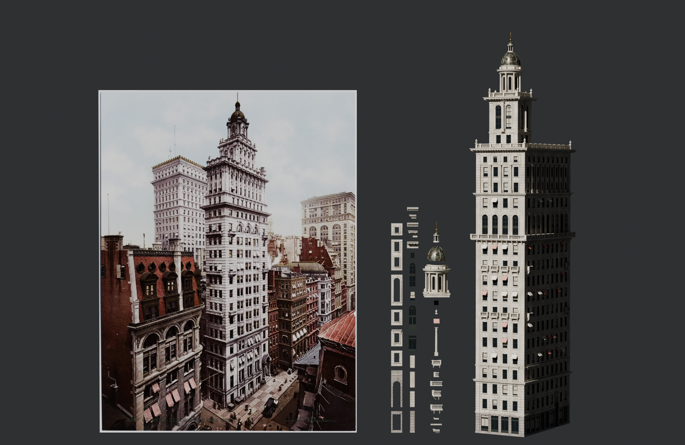
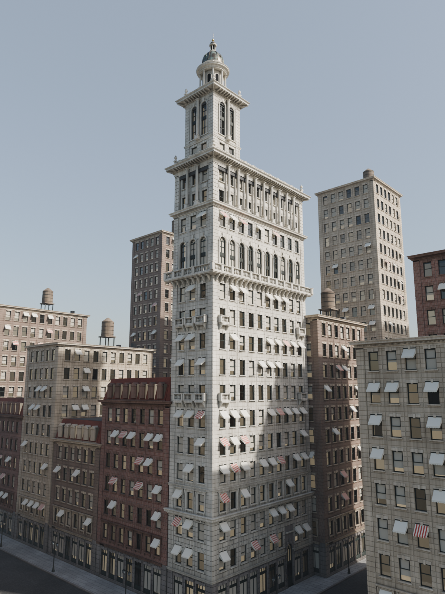
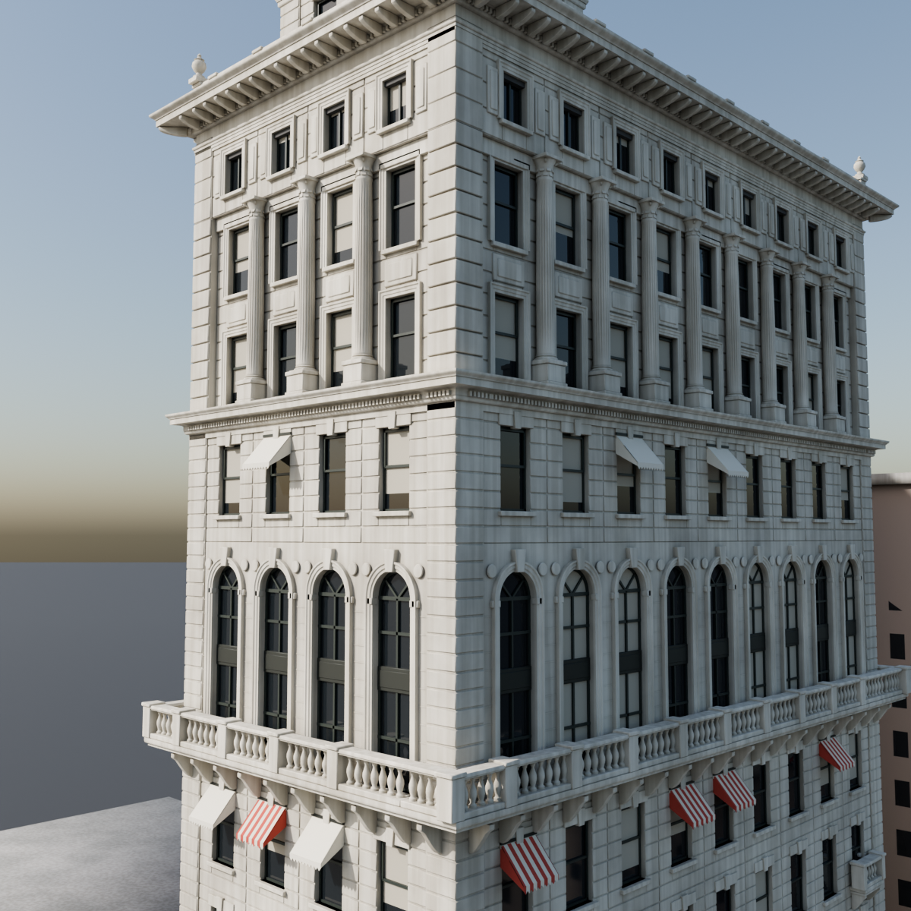
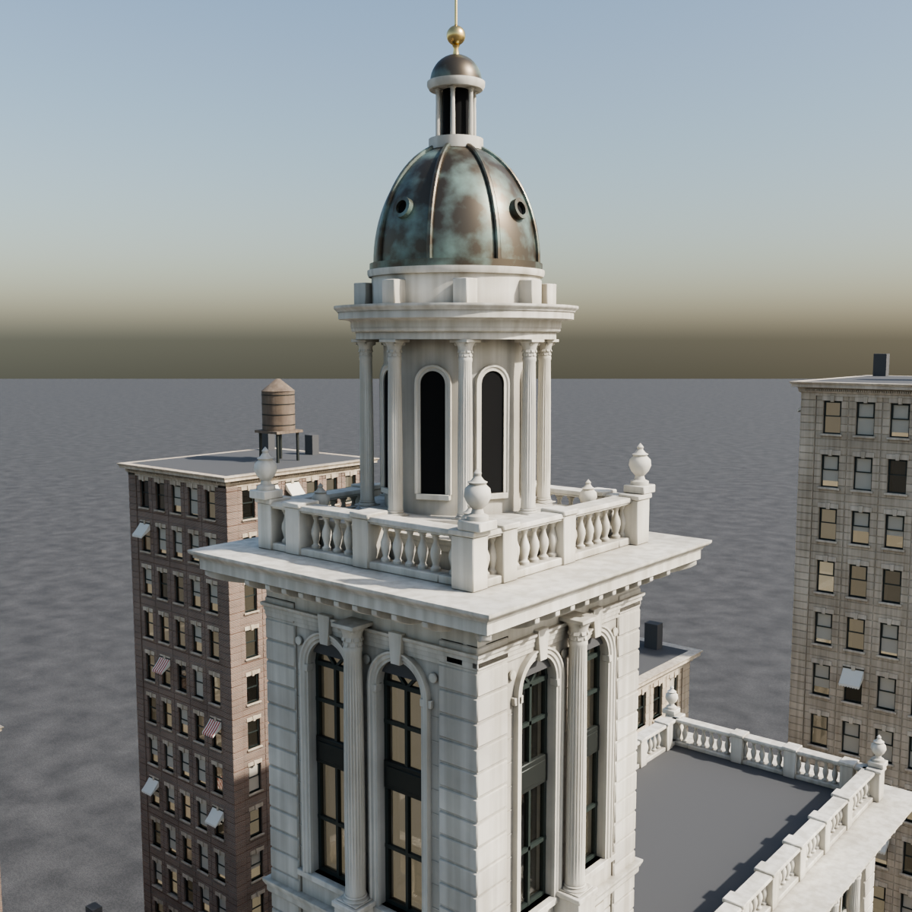
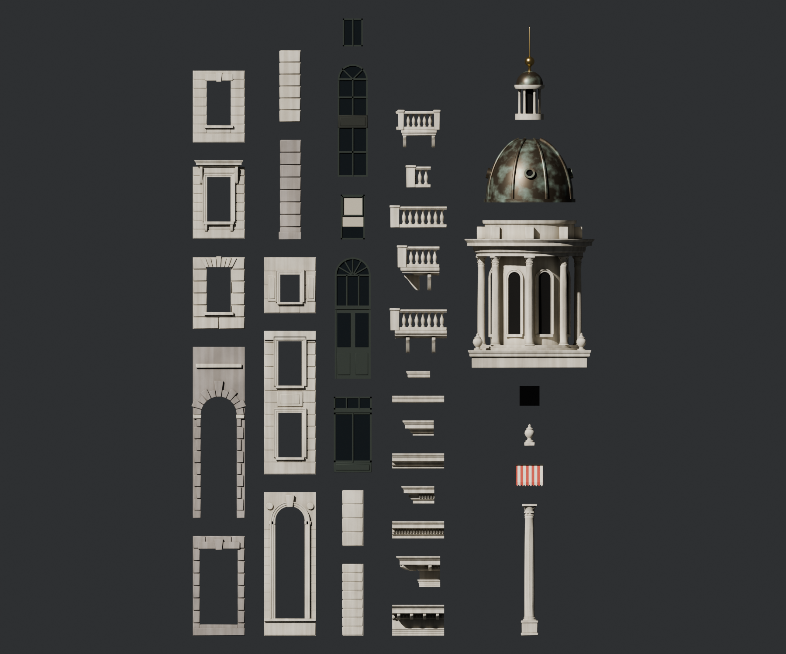

# Gillender Building: modular Blender kit



A procedural, grid-based modular kit of the **Gillender Building** (New York, 1897, demolished 1910), plus the full building assembled only from instances of that kit. `gillender_modular.py` generates all of it, so you can tweak a dimension and rebuild in seconds.

| Hero | Detail: arcade / colonnade / cornice | Detail: tower and cupola |
|---|---|---|
|  |  |  |



## Files

| File | What it is |
|---|---|
| `gillender_modular.py` | Generator: kit, materials, assembly, cameras, renders, exports |
| `out/gillender_modular.blend` | Blender 4.2 scene with collections `Gillender_Kit`, `Gillender_Building`, `Context`, `Lights_Cameras` |
| `out/gillender_kit.glb` | Every kit piece as a separate node |
| `out/gillender_building.glb` | The assembled building (instanced meshes) |
| `out/render_*.png` | Cycles renders |
| `reference_gillender_1900s.jpg` | Public-domain Detroit Publishing Co. photochrom that was used as the reference |

## Grid

| | |
|---|---|
| Bay width | 2.6 m |
| Corner pier | 1.0 × 1.0 m |
| Floor height | 3.6 m (ground floor 5.0 m) |
| Wall depth | 0.4 m |
| Footprint | 4 × 9 bays (12.4 × 25.4 m), tower 2 × 2 bays |
| Height | 18 floors, a 3-storey tower and the cupola, 93.6 m to the finial |

Module pivot: bottom-left of the bay. The facade plane is at local `y = 0`, the facade faces local `-Y` and the interior is `+Y`. Corner pieces sit at the corner and wrap the facade (`-Y`) and the previous side (`-X`). Window inserts share the pivot of their wall, so they snap with the same transform.

## Kit (37 pieces)

- **Walls:** `SM_Wall_Ground_Shop`, `SM_Wall_Ground_Entrance` (2 storeys, rusticated voussoir arch), `SM_Wall_Base_Rustic` (jack-arch lintel), `SM_Wall_Win_Hood` (architrave, consoles and hood cornice), `SM_Wall_Win_Shaft`, `SM_Wall_Arch_2F`, `SM_Wall_Colonnade_2F`, `SM_Wall_Attic`
- **Corner piers:** `SM_Pier_Corner_Ground`, `_Rustic`, `_Shaft`, `_Attic`
- **Inserts:** `SM_Window_Sash`, `SM_Window_Arch_2F`, `SM_Window_Attic`, `SM_Window_Shop`, `SM_Door_Entrance`
- **Horizontal pieces (straight and corner):** `SM_Cornice_Main` (dentils and modillions), `SM_Cornice_Mid`, `SM_Cornice_Base`, `SM_String_Course`, `SM_Balcony`, `SM_Balustrade`
- **Props:** `SM_Balconette`, `SM_Column_2F` (fluted Corinthian), `SM_Awning`, `SM_Urn`, `SM_Roof_Slab`
- **Crown:** `SM_Tempietto`, `SM_Dome` (ribbed, with oculi), `SM_Lantern`

Every building object is a linked duplicate of a kit mesh. If you edit a mesh in `Gillender_Kit`, all of its instances update.

## Materials and UVs

The materials are procedural Cycles node setups. They include limestone and granite with world-space variation, vertical weathering streaks and AO grime, plus copper patina and striped awnings. Glass uses the per-instance `Object Info > Random` value to vary the blinds, and the awnings use it to choose between striped and plain. Every mesh also has a box-projected `UVMap` at 2 m per UV tile, so you can swap in tiling textures.

The `.glb` exports use flat stand-in colours because glTF can't carry procedural nodes.

## Rebuild

```sh
# Blender 4.2+
blender -b -P gillender_modular.py -- --out out --render --ref reference_gillender_1900s.jpg

# or with the bpy wheel (pip install bpy==4.2.0, Python 3.11)
python gillender_modular.py --out out --render --ref reference_gillender_1900s.jpg
```

Options:

- `--samples N`: default 128
- `--scale PCT`: resolution percentage
- `--only hero,detail,breakdown,kit`: render only the listed shots
- Leave out `--render` to build the scene and exports only (about 5 s)

You can also paste the script into Blender's Text Editor and run it there. It builds the scene without rendering.
